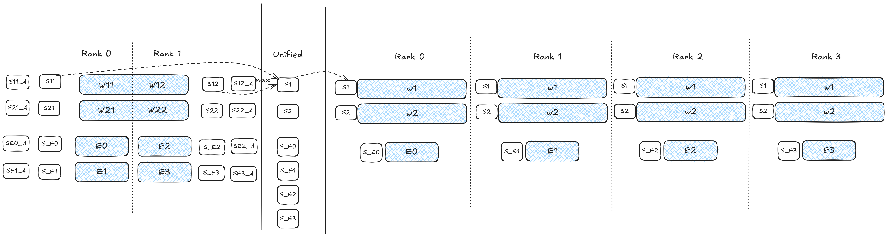

# Advanced Calibration

This page covers serving with another parallel configuration than the one used for calibration, multi-node calibration with Ray, custom calibration data, custom INC configs, and notes for Mixture of Experts (MoE) models. For the basic flow, see the [Quick Start](quickstart.md).

## Unifying Measurements to a Smaller Tensor Parallel Size

A model calibrated with tensor parallelism `N` writes one measurement file set per rank. To serve it with a smaller tensor parallel size `M`, unify the measurements: the files of each group of `N/M` consecutive ranks are merged by taking the maximum. `M` must be smaller than `N` and divide it.

Unify as part of the run with `--unify-to-tp`:

```bash
vllm-gaudi-calibrate run meta-llama/Llama-3.1-405B-Instruct -o <output_dir> --tp 16 --unify-to-tp 8 --multi-node
```

The unified files are written next to the original ones in `<output_dir>/<model_name>/<device>/`, so the same quant config serves both tensor parallel sizes. The printed serve command uses the unified size.

To unify an existing calibration, use the `unify` subcommand on the `<device>` directory:

```bash
vllm-gaudi-calibrate unify -m <output_dir>/llama-3.1-405b-instruct/g2 -r 8
```

Without `-o`, the files are written in place. The source world size is read from the `*_mod_list.json` files, so the directory must contain the measurements of one calibration run only.

If the model was calibrated with expert parallelism, the per-rank files only hold the experts local to each rank. Unify them with the expert parallel rule, which concatenates the experts of the merged ranks instead of taking the maximum: pass `--expert-parallel` to `run` (the `deepseek` preset enables it), or `--ep` to `unify`.

## Expanding MoE Measurements to Expert Parallel Ranks

For MoE models, such as [DeepSeek-R1](https://huggingface.co/collections/deepseek-ai/deepseek-r1-678e1e131c0169c0bc89728d), you can calibrate once and reuse the results across expert parallel configurations, for example 8, 16, or 32 cards. This process requires:

1. Unifying all measurement files onto a single card (world size 1).
2. Expanding the unified measurement to the target number of expert parallel ranks. Each rank keeps the per-expert intermediate maxima of the experts it owns, while other values are reused.

The following diagram presents an example in which calibration is performed on 2 cards and deployment occurs on 4 cards.



`--expand-to-ep` does both steps in one run. With `--tp` greater than 1, the measurements are unified to world size 1 first:

```bash
vllm-gaudi-calibrate run deepseek-ai/DeepSeek-R1 -o <output_dir> --tp 8 --expand-to-ep 16
```

The printed serve command then uses `--tensor-parallel-size 16 --enable-expert-parallel`. `--expand-to-ep` requires a MoE model, and the number of experts must divide evenly by the target size. The expanded files are measurement files only; INC computes the scales from them when the model is served.

To expand an existing calibration to several sizes, run the subcommands with separate output directories. The following example calibrates DeepSeek-R1 on 8 cards and prepares deployments on 16 and 32 cards:

```bash
# Unify measurements: TP8 -> TP1, expert parallel rule, measurement files only
vllm-gaudi-calibrate unify -m <output_dir>/deepseek-r1/g3 -r 1 -o <output_dir>/deepseek-r1/g3-unified-tp1 --ep --skip-scales

# Expand to EP16
vllm-gaudi-calibrate expand -m <output_dir>/deepseek-r1/g3-unified-tp1 -w 16 -o <output_dir>/deepseek-r1/g3-ep16

# Expand to EP32
vllm-gaudi-calibrate expand -m <output_dir>/deepseek-r1/g3-unified-tp1 -w 32 -o <output_dir>/deepseek-r1/g3-ep32
```

The KV cache fix (`postprocess`) is already applied by `run`, so the unified files do not need another postprocess step. To serve from a separate directory, copy the quant config and point its `dump_stats_path` to that directory, for example `<output_dir>/deepseek-r1/g3-ep16/inc_output`.

## Multi-Node Calibration with Ray

Models that need more cards than one node has, such as Llama 3.1 405B with tensor parallelism 16 on two Intel® Gaudi® 2 nodes, are calibrated on a Ray cluster with `--multi-node`. Run the procedure in a [Gaudi PyTorch container](https://docs.habana.ai/en/latest/Installation_Guide/Additional_Installation/Docker_Installation.html#use-intel-gaudi-containers) on every node.

Requirements:

- vLLM, vLLM Hardware Plugin for Intel® Gaudi®, and the calibration dependencies are installed on every node.
- The output directory is on a file system shared by all nodes, for example an NFS mount. Every rank writes its measurement files to `dump_stats_path`, and the tool checks the files of all ranks on the node where it runs.
- The model and the lm-eval datasets are available on every node.

Procedure:

1. Check that all Intel® Gaudi® NIC ports are up. Run these commands on the host, not inside the container:

    ```bash
    cd /opt/habanalabs/qual/gaudi2/bin
    ./manage_network_ifs.sh --status
    # All the ports should be in the 'up' state, you may try flipping the state
    ./manage_network_ifs.sh --down
    ./manage_network_ifs.sh --up
    # Give it a minute for the NIC to flip and check the status again
    ```

2. On every node, set the network interface used for inbound and outbound communication:

    ```bash
    # Use the 'ip a' or 'ifconfig' command to list all available network interfaces.
    export GLOO_SOCKET_IFNAME=eth0
    export HCCL_SOCKET_IFNAME=eth0
    ```

3. Start a Ray cluster with enough HPUs for the tensor parallel size:

    ```bash
    # Start Ray on the head node
    ray start --head --port=6379

    # Add worker nodes to the Ray cluster
    ray start --address='<ip-of-ray-head-node>:6379'

    # Check if the cluster has the required number of HPUs
    ray status
    ```

4. On the head node, run the calibration with `--multi-node`. Optionally unify the result to the tensor parallel size of one node:

    ```bash
    vllm-gaudi-calibrate run meta-llama/Llama-3.1-405B-Instruct -o <nfs-path>/fp8_output --tp 16 --multi-node --unify-to-tp 8
    ```

5. Serve the model with the printed command, for example:

    ```bash
    QUANT_CONFIG=<nfs-path>/fp8_output/llama-3.1-405b-instruct/maxabs_quant_g2.json \
        vllm serve meta-llama/Llama-3.1-405B-Instruct --quantization inc --kv-cache-dtype fp8_inc --tensor-parallel-size 8
    ```

You do not need to export `QUANT_CONFIG` before starting Ray. The tool sets it for each phase, and the plugin forwards it to the Ray workers.

### Environment Forwarding to Ray Workers

The plugin forwards to the Ray workers the environment variables whose names contain `HPU`, `RAY`, or `VLLM`, plus `GLOO_SOCKET_IFNAME`, `HCCL_SOCKET_IFNAME`, `NCCL_SOCKET_IFNAME`, and `QUANT_CONFIG`. This covers the variables the tool sets (see [Environment Variables](reference.md#environment-variables)). Other variables are not forwarded, including `--env` variables whose names do not match, and variables such as `HF_HOME` or `HF_TOKEN`. Set them on each node before `ray start`.

### Shared Config Buffer

If your cluster does not forward `QUANT_CONFIG` to the workers, for example with an older plugin version or a launcher that fixes the worker environment, use a shared config buffer:

1. Choose a file path on the shared file system, for example `<nfs-path>/quant_config_buffer.json`.
2. On every node, export `QUANT_CONFIG=<nfs-path>/quant_config_buffer.json` before `ray start`.
3. Pass the same path to the run:

    ```bash
    vllm-gaudi-calibrate run <model> -o <nfs-path>/fp8_output --tp 16 --multi-node --quant-config-buffer <nfs-path>/quant_config_buffer.json
    ```

Before each phase, the tool writes the phase config into the buffer file, flushes it to storage, and checks that it reads back the same content. `--quant-config-buffer` requires `--multi-node`.

## Custom Calibration Data

The calibration data comes from lm-eval tasks. Any task, group, or tag known to lm-eval can be passed with `--tasks`; run `vllm-gaudi-calibrate list-tasks` to see them. To calibrate on your own data, write an lm-eval task YAML file, put it in a directory, and pass the directory with `--include-path`.

The following task feeds the `text` field of a local JSON Lines file to the model as a loglikelihood task, like the default `pile_10k`:

```yaml
task: my_calibration_text
dataset_path: json
dataset_kwargs:
  data_files:
    train: <path>/calibration.jsonl
test_split: train
output_type: loglikelihood_rolling
doc_to_text: ""
doc_to_target: "text"
metric_list:
  - metric: word_perplexity
    aggregation: weighted_perplexity
    higher_is_better: false
metadata:
  version: 1.0
```

A generation task also exercises decode and the KV cache. The following task generates up to 256 tokens for each prompt built from the `system_prompt` and `question` fields, which are the fields the old `.pkl` datasets used:

```yaml
task: my_calibration_chat
dataset_path: json
dataset_kwargs:
  data_files:
    train: <path>/calibration.jsonl
test_split: train
output_type: generate_until
doc_to_text: "{{system_prompt}} {{question}}"
doc_to_target: ""
generation_kwargs:
  max_gen_toks: 256
metric_list:
  - metric: exact_match
metadata:
  version: 1.0
```

Run the calibration with the custom task:

```bash
vllm-gaudi-calibrate run <model> -o <output_dir> --include-path <task_dir> --tasks my_calibration_chat --limit 1024
```

`.pkl` datasets are not supported. To reuse a dataset in the old format, which is a pickled pandas DataFrame, convert it to JSON Lines once. Unpickling runs code from the file, so do this only with files you trust:

```bash
python -c "import pandas as pd; pd.read_pickle('dataset.pkl')[['system_prompt', 'question']].to_json('calibration.jsonl', orient='records', lines=True)"
```

## Custom INC Configs

By default, `run` generates the measure and quant configs from the preset. To use your own, pass `--measure-config` and `--quant-config`, for example with a template from the `calibration/quantization_config` directory:

```bash
vllm-gaudi-calibrate run <model> -o <output_dir> \
    --measure-config calibration/quantization_config/maxabs_measure.json \
    --quant-config calibration/quantization_config/maxabs_quant.json
```

The tool loads each file, resolves a relative `dump_stats_path` against the current directory, and writes the result to `<output_dir>/<model_name>/maxabs_{measure,quant}_<device>.json`, which the phases and the serve command use. The tool takes the measurement location and the observer from the measure config. If you pass only one of the two options, the generated other config takes its `dump_stats_path`. If you pass both, they must have the same `dump_stats_path`, so the QUANTIZE phase finds the measurements; the tool stops otherwise.

To check the configs before a run, use `print-config` with the same options. To change only a few keys of the generated configs, prefer the dedicated options, such as `--scale-format`, `--blocklist`, `--input-backoff`, or `--device-for-scales`. They are listed in [INC Configuration Options](reference.md#inc-configuration-options).

## Running Selected Phases

`--phases` runs a subset of the phases. For example, to compute the scales again from existing measurements with another quant setting:

```bash
vllm-gaudi-calibrate run <model> -o <output_dir> --phases quantize --scale-format CONST
```

Both configs are always written again. With `--phases quantize`, the tool removes the earlier scale files so that INC computes them from the new settings, and does not check or postprocess the measurements.

## MoE Models

- **Many experts need many samples.** For models with many routed experts, such as the DeepSeek-R1 series with 256 experts, use a diverse and sufficiently large sample set so that all experts are activated during calibration. Testing with the old scripts showed that 512 samples from [NeelNanda/pile-10k](https://huggingface.co/datasets/NeelNanda/pile-10k), each with at least 1,024 tokens, give effective coverage. The default `pile_10k` task uses the same dataset with 512 samples (`--limit`), but does not filter the samples by length.
- **Unify expert parallel measurements.** When a MoE model is calibrated with expert parallelism on more than one card, each rank measures only its local experts. Serve with the same configuration, or unify with the expert parallel rule (`--unify-to-tp`, or `--expand-to-ep` for another expert parallel size), so that every expert has its own scale. Otherwise the experts that a rank did not measure fall back to coarse quantization and FP8 accuracy drops. When a MoE model is calibrated with `--tp` greater than 1 and no `--unify-to-tp`, the tool logs a reminder.
- **Router gates stay in BF16.** The `deepseek` preset keeps `mlp.gate` in BF16 and enables expert parallelism. The `mixtral` preset keeps attention and `lm_head` in BF16.
- **Fused MoE detection.** Unify and expand treat a node as a fused MoE op only when it has per-expert child nodes (`.w13_list.<id>` or `.w2_list.<id>`). Plain layers whose names contain `moe`, such as Mixtral's `block_sparse_moe.gate`, are merged as ordinary layers.
