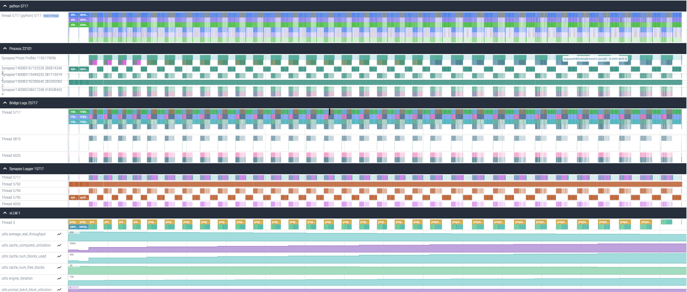

# End-to-End Profiling

This method enables collecting all traces in a single file while providing precise control over when trace collection starts and stops. It simplifies analysis by consolidating all profiling data into a single file. However, this can result in a larger trace file, which may be more difficult to load and analyze in browsers or tools such as Perfetto. To avoid generating large trace files, we recommend using methods included within
end-to-end (E2E) profiling separately, when the full trace is not required.

E2E profiling captures all relevant data in a single run, combining:

- [High-level profiling](high-level-profiling.md)
- [PyTorch profiling via asynchronous server](pytorch-profiling-async.md)
- [PyTorch profiling via script](pytorch-profiling-script.md)

Due to the large amount of data collected during E2E profiling, Python stack events in the PyTorch Profiler are disabled by default. If you need Python stack events, use either [PyTorch profiling via asynchronous server](pytorch-profiling-async.md) or [PyTorch profiling via script](pytorch-profiling-script.md), as both methods collect these events by default.

While you can collect hardware traces, we do not recommend doing so during E2E profiling because it significantly increases the trace file size. For hardware-level profiling, see [this](profiling-prompt-decode.md) document.

To execute E2E profiling, use one of the following procedures.

## Server Profiling with a Single Request

1. Disable hardware tracing to reduce the trace size. Skip this step if you want to collect the hardware traces.

    ```bash
    hl-prof-config --use-template profile_api --hw-trace off
    export HABANA_PROFILE=1
    ```
  
2. Enable E2E profiling.

    ```bash
    export VLLM_PROFILER_ENABLED=full
    ```

3. Set the output directory.

    ```bash
    export VLLM_TORCH_PROFILER_DIR=/tmp
    ```

4. Start the vLLM server. The following example uses the `facebook/opt-125m` model, `TP=1`, and the maximum batch size of `128`.

    ```bash
    VLLM_PROMPT_SEQ_BUCKET_MAX=128 VLLM_PROMPT_SEQ_BUCKET_MIN=128 \
    python3 -m vllm.entrypoints.openai.api_server --port 8080 \
    --model "facebook/opt-125m" --tensor-parallel-size 1 \
    --max-num-seqs 128 --dtype bfloat16 \
    --max-model-len 256
    ```

5. Wait until the warm-up is completed and start profiling.

    ```bash
    curl -X POST http://localhost:8080/start_profile
    ```

6. Send requests for profiling.

    ```bash
    curl http://localhost:8080/v1/completions \
    -H "Content-Type: application/json" \
    -d '{
        "model": "facebook/opt-125m",
        "prompt": "San Francisco is a",
        "max_tokens": 7,
        "temperature": 0
    }'
    ```

7. Stop profiling.

    ```bash
    curl -X POST http://localhost:8080/stop_profile
    ```

## Server Profiling with Multiple Requests

1. Disable hardware tracing to reduce the trace size. Skip this step if you want to collect the hardware traces.

    ```bash
    hl-prof-config --use-template profile_api --hw-trace off
    export HABANA_PROFILE=1
    ```

2. Enable E2E profiling.

    ```bash
    export VLLM_PROFILER_ENABLED=full
    ```

3. Set the output directory.

    ```bash
    export VLLM_TORCH_PROFILER_DIR=/tmp
    ```

4. Start the vLLM server. The following example uses the `facebook/opt-125m` model, `TP=1`, and the maximum batch size of `128`.

    ```bash
    VLLM_PROMPT_SEQ_BUCKET_MAX=128 VLLM_PROMPT_SEQ_BUCKET_MIN=128 \
    python3 -m vllm.entrypoints.openai.api_server --port 8080 \
    --model "facebook/opt-125m" --tensor-parallel-size 1 \
    --max-num-seqs 128 --dtype bfloat16 \
    --max-model-len 256
    ```

5. Install the `datasets` package.

    ```bash
    pip install datasets
    ```

6. Send requests for profiling using the vLLM serving.

    ```bash
    vllm bench serve \
            --backend vllm \
            --model "facebook/opt-125m" \
            --port 8080 \
            --dataset-name "random" --random-input-len 128 --random-output-len 4 \
            --random-range-ratio 1.0 \
            --ignore-eos \
            --profile \
            --max-concurrency "4" \
            --request-rate "inf" \
            --num-prompts 4 \
            --percentile-metrics "ttft,tpot,itl,e2el"
    ```

## Script Profiling

1. Disable hardware tracing to reduce the trace size. Skip this step if you want to collect the hardware traces.

    ```bash
    hl-prof-config --use-template profile_api --hw-trace off
    export HABANA_PROFILE=1
    ```

2. Enable E2E profiling.

    ```bash
    export VLLM_PROFILER_ENABLED=full
    ```

3. Set the output directory.

    ```bash
    export VLLM_TORCH_PROFILER_DIR=/tmp
    ```

4. Enable tracing in the script by instructing the LLM object to start and stop profiling.

    ```bash
    from vllm import LLM, SamplingParams
    llm = LLM(model="facebook/opt-125m")
    llm.start_profile() # Start profiling
    outputs = llm.generate(["San Francisco is a"])
    llm.stop_profile() # Stop profiling
    ```

## Results

Performing E2E profiling results in generating a `vllm(...).pt.trace.json.gz` file that can be opened using [Perfetto](https://perfetto.habana.ai).



This file provides information about host gaps, prompt and decode durations, recompilation events, and python execution times.
