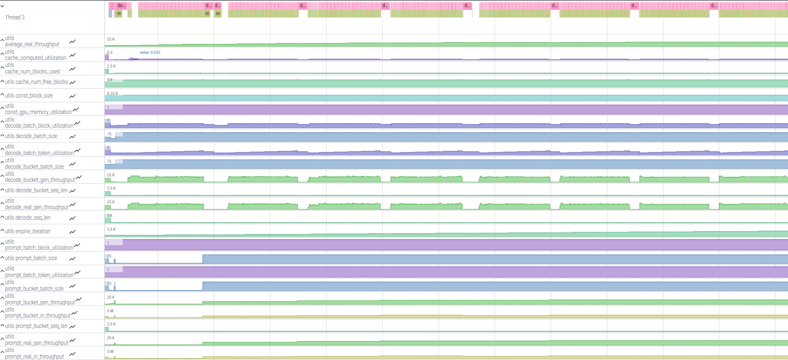

# High-Level Profiling

!!! note
    This method is part of end-to-end profiling and does not need to be performed separately if end-to-end profiling has already been completed.

Due to the dynamic nature of serving inference - where prompts and decodes may arrive on unpredictable schedules and run over extended periods - it is often useful to gain visibility into what is actually being executed.
High-level profiling does not accurately represent the real execution time of prompt or decode phases. This limitation is due to the asynchronous measurement approach used.
For example, in scenarios involving delayed sampling or multi-step scheduling, the system avoids synchronizing the host with the device solely to indicate when the device has paused execution. Doing so would negatively impact performance.
Therefore, the time recorded for each prompt or decode phase reflects host-side timing only, and should therefore be interpreted with caution.

You can enable the high-level profiling using the `export VLLM_PROFILER_ENABLED=true` flag.
As a result, a `server_events(...).json` file is generated and can be viewed using [Perfetto](https://perfetto.habana.ai):

This file provides debug information about prompt and decode batch sizes, input lengths, the number of used blocks, and decode and prompt buckets used for `seq_len` and `batch size`. This information is presented in a timeline with minimal trace size.
