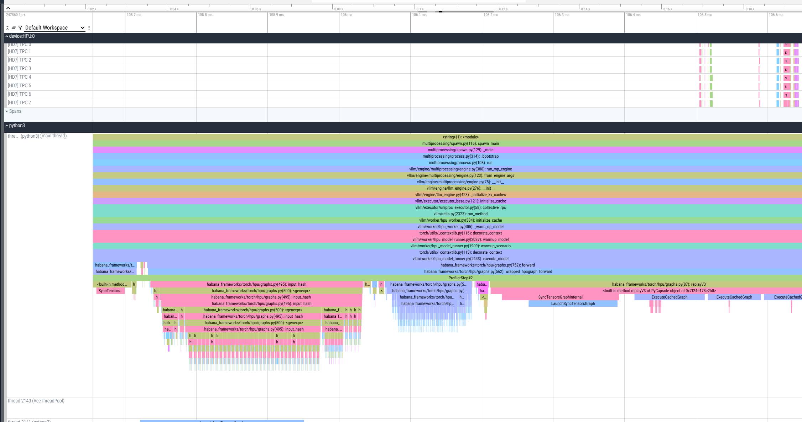
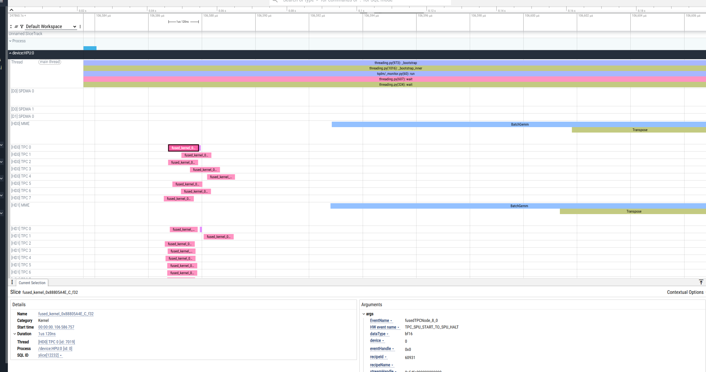
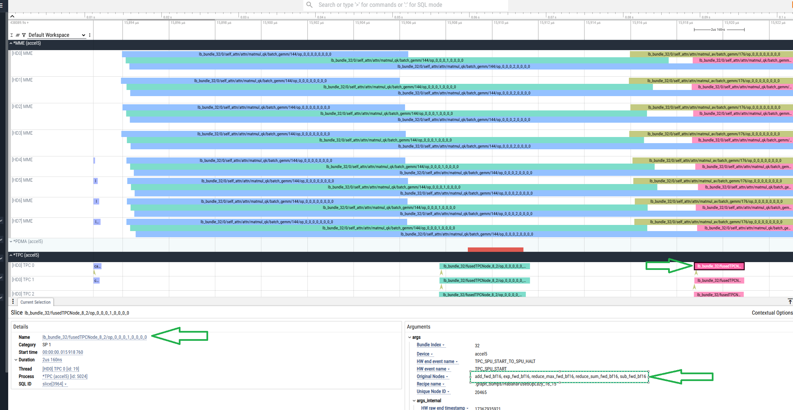

# Profiling Specific Prompt or Decode Execution

This method provides basic CPU and HPU profiling information, such as timeline and duration of operations.

## Executing Profiling

To execute the profiling, follow these steps:

1. Define the profiling scope using the following format:

    ```
    VLLM_PT_PROFILE=<phase>_<batch_size>_<size>_<hpu_graph_flag>
    ```     

    Where:

   - `<phase>`: Phase, either prompt or decode
   - `<batch_size>`: Batch size to profile
   - `<size>`: Input length (for prompt) or number of blocks (for decode)
   - `<hpu_graph_flag>`: Flag indicating whether to include the HPU graph, either t (true) or f (false)

    For example, profile decode with batch size 256, 2048 blocks, and HPU graphs, should have this format:

    ```
    VLLM_PT_PROFILE=decode_256_2048_t
    ``` 

2. Run the inference command with the appropriate profiling flag, as in the following example.

    ```bash
    VLLM_PT_PROFILE=decode_256_2048_t python3 -m vllm.entrypoints.openai.api_server \
      --port 8080 \
      --model "facebook/opt-125m" \
      --tensor-parallel-size 1 \
      --max-num-seqs 256 \
      --dtype bfloat16 \
      --max-model-len 256
    ```

This profiling mode ends with an intentional assertion after collecting the requested trace. This is expected behavior, and the profiling data is successfully collected. As a result, a `*.pt.trace.json.gz` file is generated and saved in the current working directory. It can be viewed using [Perfetto](https://perfetto.habana.ai):



## Enhancing Profiler Configuration

To gain more detailed insights into device-level behavior, such as fused graph structures, node names, and trace analyzer data, enhance the profiler configuration by following these steps:

1. Configure profiler to collect detailed traces.

    ```
    hl-prof-config --use-template profile_api_with_nics --fuser on --trace-analyzer on
    ```      

2. Set the following flags.

    ```
    export HABANA_PROFILE_WRITE_HLTV=1
    export HABANA_PROFILE=1
    ```     

3. Run the profiling with enhanced configuration. The following example uses decode profiling with detailed traces.

    ```
    HABANA_PROFILE_WRITE_HLTV=1 HABANA_PROFILE=1 VLLM_PT_PROFILE=decode_256_512_t \
      python3 -m vllm.entrypoints.openai.api_server \
      --port 8080 \
      --model "facebook/opt-125m" \
      --tensor-parallel-size 1 \
      --max-num-seqs 256 \
      --dtype bfloat16 \
      --max-model-len 256
    ```

As a result, the `.hltv` file is generated in the current directory in addition to the `*.pt.trace.json.gz` file:




The `.hltv` file contains node names, graph structures, and information on what is inside each fused op.
