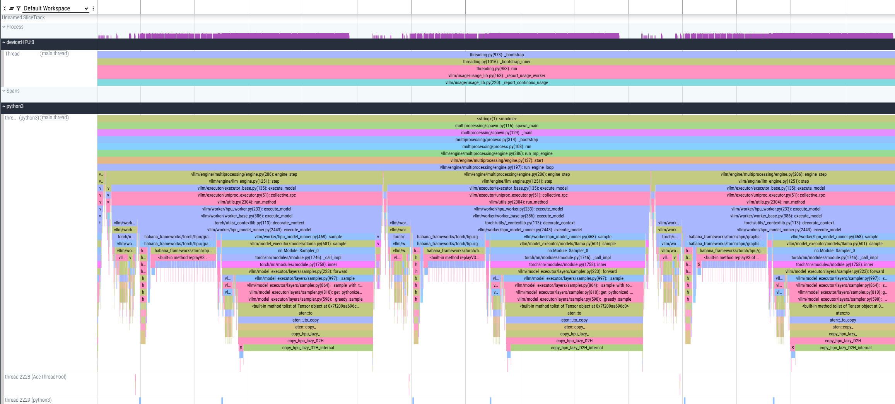

# PyTorch Profiling via Asynchronous Server

!!! note
    This method is part of end-to-end profiling and does not need to be performed separately if end-to-end profiling has already been completed.

To profile a vLLM server using PyTorch tracing tools, use one of the following procedures.

While you can collect hardware traces, we do not recommend doing so during profiling via asynchronous server because it significantly increases the trace file size. For hardware-level profiling, see [this](profiling-prompt-decode.md) document.

## Server Profiling with a Single Request

1. Disable hardware tracing to reduce the trace size. Skip this step if you want to collect the hardware traces.

    ```bash
    hl-prof-config --use-template profile_api --hw-trace off
    ```

2. Set the output directory.

    ```bash
    export VLLM_TORCH_PROFILER_DIR=/tmp
    ```

3. Start the vLLM server. The following example uses the `facebook/opt-125m` model, `TP=1`, and the maximum batch size `128`.

    ```bash
    VLLM_PROMPT_SEQ_BUCKET_MAX=128 VLLM_PROMPT_SEQ_BUCKET_MIN=128 \
    python3 -m vllm.entrypoints.openai.api_server --port 8080 \
        --model "facebook/opt-125m" --tensor-parallel-size 1 \
        --max-num-seqs 128 --dtype bfloat16 \
        --max-model-len 256
    ```

4. Wait until the warm-up is completed and start profiling.

    ```bash
    curl -X POST http://localhost:8080/start_profile
    ```

5. Send requests for profiling.

    ```bash
    curl http://localhost:8080/v1/completions \
        -H "Content-Type: application/json" \
        -d '{
        "model": "facebook/opt-125m",
        "prompt": "San Francisco is a",
        "max_tokens": 7,
        "temperature": 0
    }'
    ```

6. Stop profiling.

    ```bash
    curl -X POST http://localhost:8080/stop_profile
    ```

## Server Profiling with Multiple Requests

1. Disable hardware tracing to reduce the trace size. Skip this step if you want to collect the hardware traces.

    ```bash
    hl-prof-config --use-template profile_api --hw-trace off
    ```

2. Set the output directory.

    ```bash
    export VLLM_TORCH_PROFILER_DIR=/tmp
    ```

3. Start the vLLM server. The following example uses the `facebook/opt-125m` model, `TP=1`, and the maximum batch size `128`.

    ```bash
    VLLM_PROMPT_SEQ_BUCKET_MAX=128 VLLM_PROMPT_SEQ_BUCKET_MIN=128 \
    python3 -m vllm.entrypoints.openai.api_server --port 8080 \
        --model "facebook/opt-125m" --tensor-parallel-size 1 \
        --max-num-seqs 128 --dtype bfloat16 \
        --max-model-len 256
    ```

4. Install the `datasets` package.

    ```bash
    pip install datasets
    ```

5. Send requests for profiling using the the vLLM serving.

    ```bash
    vllm bench serve \
        --backend vllm \
        --model "facebook/opt-125m" \
        --port 8080 \
        --dataset-name "random" --random-input-len 128 --random-output-len 4 \
        --random-range-ratio 1.0 \
        --ignore-eos \
        --profile \
        --max-concurrency "4" \
        --request-rate "inf" \
        --num-prompts 4 \
        --percentile-metrics "ttft,tpot,itl,e2el"
    ```

## Results

Performing this profiling results in generating a `*.pt.trace.json.gz` file that can be opened using [Perfetto](https://perfetto.habana.ai).



The file shows profiling of multiple prompts and decodes, where decode operations are measured, and host-side gaps between them can also be observed for analysis.
