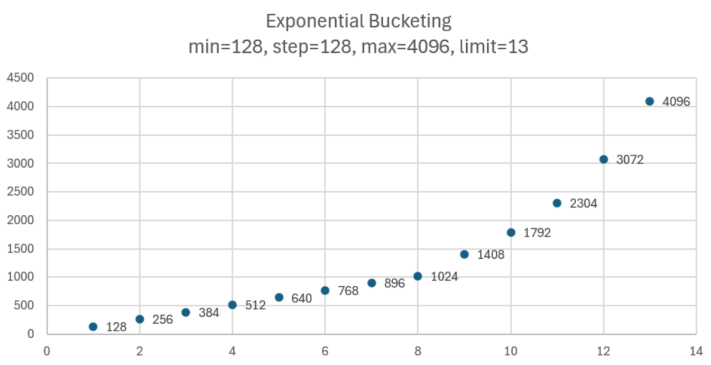
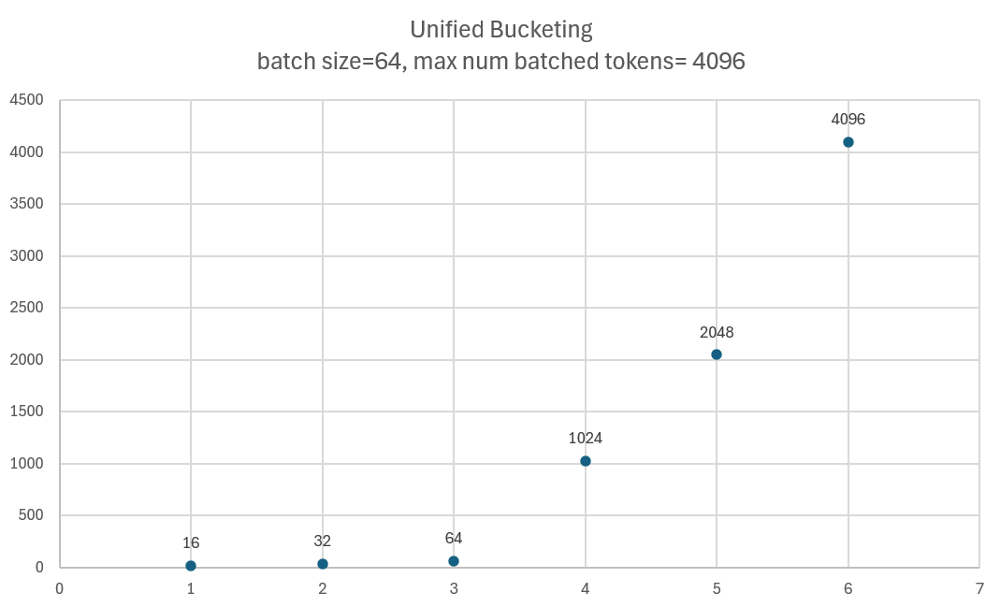

# Bucketing Mechanism

Intel® Gaudi® accelerators perform best when operating on models with fixed tensor shapes. [Intel® Gaudi® Graph Compiler](https://docs.habana.ai/en/latest/Gaudi_Overview/Intel_Gaudi_Software_Suite.html#graph-compiler-and-runtime)
generates optimized binary code that implements the given model topology on Intel® Gaudi®. In its default configuration, the produced binary code may be highly dependent on input and output tensor shapes, requiring graph recompilation
when encountering tensors with different shapes within the same topology. While these binaries efficiently use Intel® Gaudi®, the compilation process itself can introduce noticeable overhead in end-to-end execution.
In dynamic inference serving scenarios, minimizing the number of graph compilations and reducing the risk of graph compilation occurring during server runtime is important. Currently, this is achieved by
"bucketing" the model's forward pass across three dimensions.

Bucketing significantly reduces the number of required graphs but does not handle graph compilation or device code generation. These tasks are performed during the warm-up and HPU Graph capture phase.

## Bucketing Strategies

Bucketing is focused on three dimensions:

- `batch size`: The number of samples per batch.
- `query lenght`: The sequence length without context tokens.
- `num blocks`: The context length counted in blocks.

Bucketing ranges are generated based on 4 parameters - `min`, `step`, `max`, and `limit` - applied separately for the prompt and decode phases, as well as for batch size, query length, and context block dimensions. These parameters are logged and can be observed during vLLM startup:

```{.}
INFO 07-07 19:27:37 [exponential.py:36] Prompt bucket config (min, step, max_warmup, limit) bs:[1, 1, 1, 1], seq:[128, 128, 1024, 11]
INFO 07-07 19:27:37 [common.py:85] Generated 36 prompt buckets [bs, query, num_blocks]: [(1, 128, 0), (1, 128, 1), (1, 128, 2), (1, 128, 3), (1, 128, 4), (1, 128, 5), (1, 128, 6), (1, 128, 7), (1, 256, 0), (1, 256, 1), (1, 256, 2), (1, 256, 3), (1, 256, 4), (1, 256, 5), (1, 256, 6), (1, 384, 0), (1, 384, 1), (1, 384, 2), (1, 384, 3), (1, 384, 4), (1, 384, 5), (1, 512, 0), (1, 512, 1), (1, 512, 2), (1, 512, 3), (1, 512, 4), (1, 640, 0), (1, 640, 1), (1, 640, 2), (1, 640, 3), (1, 768, 0), (1, 768, 1), (1, 768, 2), (1, 896, 0), (1, 896, 1), (1, 1024, 0)]
INFO 07-07 19:27:37 [common.py:85] Generated 42 decode buckets [bs, query, num_blocks]: [(1, 1, 128), (1, 1, 256), (1, 1, 384), (1, 1, 512), (1, 1, 640), (1, 1, 768), (1, 1, 896), (1, 1, 1024), (1, 1, 1408), (1, 1, 1792), (1, 1, 2432), (1, 1, 3328), (1, 1, 4352), (1, 1, 5888), (2, 1, 128), (2, 1, 256), (2, 1, 384), (2, 1, 512), (2, 1, 640), (2, 1, 768), (2, 1, 896), (2, 1, 1024), (2, 1, 1408), (2, 1, 1792), (2, 1, 2432), (2, 1, 3328), (2, 1, 4352), (2, 1, 5888), (4, 1, 128), (4, 1, 256), (4, 1, 384), (4, 1, 512), (4, 1, 640), (4, 1, 768), (4, 1, 896), (4, 1, 1024), (4, 1, 1408), (4, 1, 1792), (4, 1, 2432), (4, 1, 3328), (4, 1, 4352), (4, 1, 5888)]
```

!!! warning
    If a request exceeds the maximum bucket size in any dimension, it will be processed without padding, and its processing may require a graph compilation, potentially significantly increasing end-to-end latency.
    The boundaries of the buckets are user-configurable via environment variables, and upper bucket boundaries can be increased to avoid such scenario.

For example, if a request with 3 sequences, each having a maximum sequence length of 412, is sent to an idle vLLM server, it will be padded and executed as a `(4, 512, 0)` prefill bucket, where:

- 4 is the batch size padded up to the nearest supported value above 3
- 512 is the sequence length padded up to the nearest supported value above 412

After the prefill stage, it will be executed as a `(4, 1, 512)` decode bucket, which remains in use until either:

- The batch dimension changes (for example, when a request completes), at which point it will become `(2, 1, 512)`.
- The context length exceeds 512 tokens, in which case it will become `(4, 1, 640)`.

Bucketing is transparent to the user – padding in the sequence length dimension is never returned, and padding in the batch dimension does not create new requests.

There are three bucketing strategies: exponential (default), linear, and unified.

### Exponential Strategy

The exponential strategy is the default warm-up mechanism. It is based on 4 parameters that are not configurable by the user:

- `min`: The minimum value
- `step`: The rounding value for bucket boundaries
- `max`: The maximum value
- `limit`: The maximum number of buckets

The exponential bucketing strategy applies exponential spacing between buckets. The `min` and `max` values are always included in the warm-up, and the intermediate values are calculated using an exponent. The base remains unchanged. If duplicate values are generated, they are removed to ensure the warm-up process is as efficient as possible. All the values generated in this way, ranging from batch size, query length and context blocks, will be warmed up with each other.

The following example presents a possible distribution:

```{.}
min = 128, step = 128, max = 4096, limit = 13
```



This strategy creates more buckets with smaller values closer to `min`. As the values increase toward `max`, the buckets become less frequent, meaning the distance between them increases. This helps prioritize warming up the smaller values more precisely, while still covering the full range.

### Linear Strategy

!!! note
    Starting from v1.22.0 Intel Gaudi Software release, Linear strategy is no longer the default warm-up mechanism.

The linear strategy is determined with 3 parameters: `min`, `step` and `max`, where:

- `min`: The minimum value of the bucket
- `step`: The interval between buckets
- `max`: The maximum value of the bucket

These parameters can be configured separately by the user for the prompt and decode phases, as well as for the batch size and sequence length dimensions. The interval between `min` and `step` has special handling: `min` is multiplied by consecutive powers of two until the multiplier is less than or equal to `step`. We refer to this as the ramp-up phase, which is used for handling lower batch sizes with minimal wastage, while allowing for larger padding on larger batch sizes.

=== "Example with ramp-up"
    ```{.}
    min = 2, step = 32, max = 64
    => ramp_up = (2, 4, 8, 16)
    => stable = (32, 64)
    => buckets = ramp_up + stable => (2, 4, 8, 16, 32, 64)
    ```
=== "Example without ramp-up"
    ```{.}
    min = 128, step = 128, max = 512
    => ramp_up = ()
    => stable = (128, 256, 384, 512)
    => buckets = ramp_up + stable => (128, 256, 384, 512)
    ```

### Unified Strategy

The unified strategy is dedicated to Unified Attention. Its buckets are determined by the following non-configurable parameters:

- `query length`: The number of currently processed tokens, excluding context tokens.
- `shared num blocks`: The context length measured in blocks. It includes only blocks that are shared between at least two block tables, in different requests, or blocks used by at least two tokens in the query.
- `unique num blocks`: The context length measured in blocks. It includes only blocks that are not shared between block tables and are used by one token.
- `is causal`: Indicates whether there is at least one prompt in the batch. Possible values are 0 or 1.

Unified bucketing prepares buckets for both prompt and decode as one, known as `unified cfg`.

#### Alpha Version

Currently there are six points in ranges for query length, shared blocks and unique blocks. They are based on `max num seqs` and `max num batched tokens` values. The points are set at the whole, half, and one-quarter values of both parameters, resulting in a total of six points.

The following example presents a possible distribution:

```{.}
batch size = 64, max num batched tokens = 4096
```



Additionally for context blocks, both shared and unique, a value of `0` is also included, resulting in the following bucketing:

```{.}
INFO 09-23 12:32:43 [common.py:100] Generated 375 unified buckets [query, shared_blocks, unique_blocks]: [(8, 0, 0, 1), (8, 0, 8, 0), ..., (2048, 256, 2890, 1), (2048, 256, 5781, 1)]
```

The following example presents a setup where every bucket is logged separately in the warm-up phase:

```{.}
(EngineCore_DP0 pid=805) INFO 09-23 12:32:50 [hpu_model_runner.py:3320] [Warmup][Unified CFG][2/375] query_len:2048 shared_blocks:256 unique_blocks:2890 (causal) free_mem:11.16 GiB
(EngineCore_DP0 pid=805) INFO 09-23 12:32:53 [hpu_model_runner.py:3320] [Warmup][Unified CFG][3/375] query_len:2048 shared_blocks:256 unique_blocks:1445 (causal) free_mem:11.16 GiB
(EngineCore_DP0 pid=805) INFO 09-23 12:32:56 [hpu_model_runner.py:3320] [Warmup][Unified CFG][4/375] query_len:2048 shared_blocks:256 unique_blocks:32 (causal) free_mem:11.16 GiB
```

### Specifying Buckets in a File

File-based bucketing allows you to manually configure precise buckets by specifying them in a configuration file. To use this approach, set the `VLLM_BUCKETING_FROM_FILE` flag to the path of your configuration file.

You can define buckets in a file using three approaches.

- **Precise bucket**: Prepares only one, specific bucket. The following example creates two buckets in total: `(1, 2048, 0)` and `(64, 1, 1024)`.

```{.}
(1, 2048, 0)
(64, 1, 1024)
```

- **List**: Prepares each bucket from the Cartesian product of the elements in the provided list. The following example creates six buckets: `(1, 256, 0)`, `(1, 256, 4)`, `(1, 256, 8)`, `(1, 512, 0)`, `(1, 512, 4)`, and `(1, 512, 8)`.

```{.}
(1, [256, 512], [0, 4, 8])
```

- **Range**: Works similarly to the list, but instead of manually setting each element, you can use python's range function. The following example creates three buckets: `(1, 1, 256)`, `(1, 1, 384)`, and `(1, 1, 512)`.

```{.}
(1, 1, range(256, 512, 128))
```

You can mix these three approaches in a single file, for example `([64, 128, 256], 1, range(512, 1024, 32))` is a valid configuration.

Each bucket or a configuration has to be provided in a separate line. You can find a sample bucketing in [bucketing_file.txt](https://github.com/vllm-project/vllm-gaudi/blob/main/vllm_gaudi/extension/bucketing/bucketing_file.txt).

!!! note
    Currently, bucketing from a file is not supported for unified attention.
