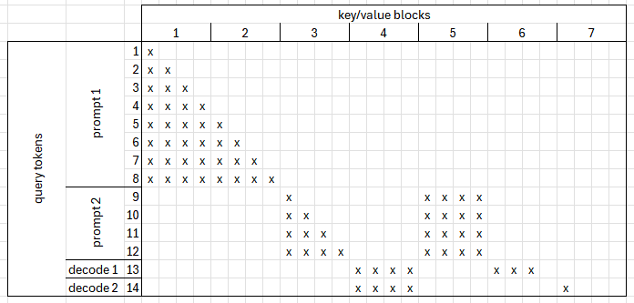
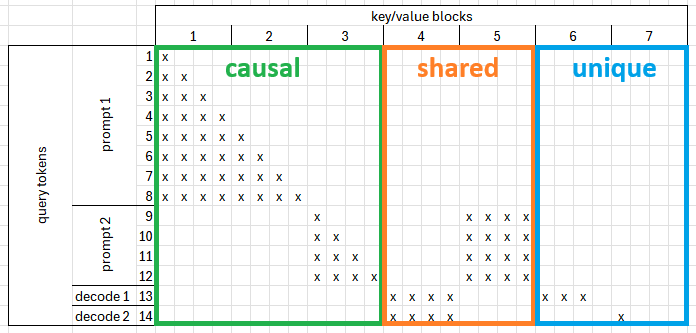
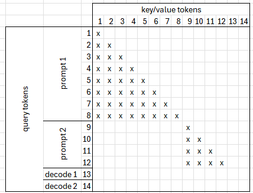
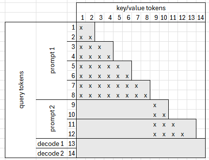
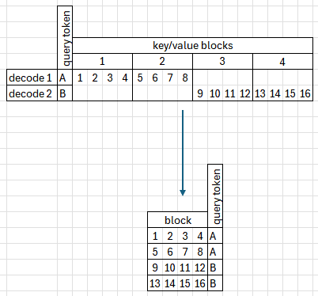

{ #unified_attn }

## Overview

vLLM Hardware Plugin for Intel® Gaudi® v1.23.0 introduces a new attention backend called Unified Attention, which unifies several previous algorithms into a single implementation. As a newly added backend, it currently supports a subset of the planned features. Compared to earlier approaches, it provides the following advantages:

- Proper handling of shared blocks when using a contiguous KV cache
- Support for mixed batches, enabling prefill and decode tokens to run in a single batch
- Flattened query token processing, for example, allowing all query tokens to be processed without a separate `seq_len` dimension

## Algorithm

To understand the algorithm, let’s walk through a concrete example. Assuming the following setup:

- Block size: 4
- Batch: 4 samples, consisting of 2 prefill samples and 2 decode samples
- Query lengths: [8, 4, 1, 1]
- Context lengths: [0, 4, 6, 4]
- Attention mechanism: Scaled dot-product attention

$$\text{Attention}(Q, K, V, B) = \text{softmax}\left( s \cdot QK^\top + B \right) V$$

In this example, you can observe that:

- Some blocks are used only by a single token, while others are shared.
- Some of the recently calculated key values are available alongside the queries, eliminating the need to fetch them from a cache.

In a simple implementation we would just multiply the entire query by the key and value and use appropriate bias to mask unused fields. However, this approach is highly inefficient, especially for decodes, where usually there is only a single token per sample in a batch and there is almost no overlap between used blocks.

An alternative could be to slice queries and keys into chunks and multiply only the relevant regions. Although this approach is currently technically challenging to implement.

Instead, we divide the computation into 3 separate parts and merge the results at the end.

## Splitting Softmax

The main technique used in Unified Attention is splitting and merging softmax values. Softmax is defined as:

$$\text{softmax}(x_i) = \frac{e^{x_i-c}}{\sum_{j} e^{x_j-c}}, c = max(x_i)$$

The problem lies in the denominator, as it contains the sum of all terms. This is why we split the calculation into two separate softmax operations and then adjust and combine the results. Let's say we have the following variables:

$$z_1, z_2\text{ - local softmax results} \\ c_1, c_2 \text{ - local maxima} \\ s_1, s_2 \text{ - local sums}$$

We can then calculate the following:

$$c = max(c_1, c_2) \\ adj_i = e^{c_i-c} \\ s = s_1 *adj_1 + s_2* adj_2\\ z_i\prime = \frac{z_i*s_i*adj_i}{s} $$

This way, we calculate parts of softmax and later readjust and recombine the values into the final result. There are two other optimizations that we can use. As the process ultimately involves division by the global sum, we can skip the division by local sums followed by multiplying by local sums during readjustment, preserving intermediate softmax values without division. Additionally, since readjustment involves multiplication by a constant, we can use the following rules:

$$(sA)B=s(AB) \\ [A; B; C+D] \times [A; C+D; E] = [A; B; C] \times [A; C; E] + [A; B; D] \times [A; D; E] = [A; B; E]$$

This makes it possible to move softmax readjustment after the multiplication by V in the attention computation.

## Causal Attention

Causal attention is used to calculate attention values between currently computed Q, K, and V. Since this data has been recently calculated, it does not need to be fetched from the KV cache. Prompt lengths are usually much longer than `max_num_seqs`. This means that we do not need to distinguish which tokens are used in prompts and which in decodes and use the whole Q relying on attention bias to mask out unnecessary tokens. Since we use all query tokens sequentially, it works similarly to the merged prefill feature. The following example presents how the computed causal bias may look like:

We can divide query into equal slices so that each slice uses keys of different lengths:

This way, we can skip parts of the computation where `index(key)` is greater than `index(query)`. In the current implementation, slice size is constant and set to 512 based on experimental results.

## Shared Attention

Shared attention is used when multiple tokens share a single context block. This is usually the case when there is a prompt with parts of the context cached or during decoding when multiple samples share a common prefix. Since shared blocks are used more than once, all of them are fetched and multiplied by all query tokens. Usually, the number of shared blocks is relatively small compared to whole KV cache, which makes fetching them better than relying on tricks, such as `contiguous_pa`. The main challenge is creating the `shared_bias`.

## Unique Attention

Since we know that each block is used by upmost one token, we can use two optimizations:

- Compute attention per block instead of per query token
- Contiguous slice of KV cache instead of fetching individual blocks

The first optimization allows better handling of batches with large differences between sequence lengths. For example, if we have two samples in a batch, using [4, 12] context blocks respectively, instead of padding the `block_table` to the highest number of blocks, we can use flattened list of blocks. This way, the amount of compute we need scales with the sum of `blocks_used` instead of `bs * max(num_blocks)`. This simplified diagram presents how it works:

The main difficulty in this approach is that several blocks may be used in a single query token, preventing direct softmax computation. However, we can use the same approach to calculate softmax in parts and then readjust.

The second optimization is based on the fact that during decoding each block usually needs to be fetched only once. Since the process requires fetching the most of the KV cache anyway, it is possible to use a contiguous chunk instead. While this optimization is optional from the perspective of the Unified Attention algorithm, the current unified batch creation process assumes it is enabled by default.

## Merging Intermediate Values

There are 3 optional code paths that Unified Attention code can take:

- Causal attention
- Shared attention
- Unique attention

Each of those code paths returns a triplet: either (`local_attn`, `local_max`, `local_sum`) or (`None`, `None`, `None`) if that path is skipped. The last step is to combine partial values, readjust them, and combine them together using the previously described method.

## Unified/Mixed Batches

One of the main benefits of Unified Attention is that it does not distinguish between prompt and decode tokens and the whole attention pass can be computed by a single function without breaking synapse graphs. This means that we no longer need to do any kind of preprocessing of scheduler output, such as sorting and separating prompts and decodes. The active code paths in Unified Attention are determined by the presence of specific bias tensors in the attention metadata:

- `causal_bias` => causal attention is enabled
- `shared_bias` => shared attention is enabled
- `unique_bias` => unique attention is enabled

This means that there are 8 possible code paths, which is reflected when printing the specific configuration being run. For example, phase string of "csu" means that all 3 code paths are used whereas '--u' means that only Unique Attention is being run.

Most of the model forward code relies only on `query_len`. Two other dimensions are important when calculating Unified Attention - `num_shared_blocks` and `num_unique_blocks`. When `contiguous_pa` is enabled for Unified Attention, which is currently enforced, `num_unique_blocks` equals the size of the KV cache slice that needs to be use. This value depends on the `max(block_id)` currently in use.

The next consideration is whether to include `causal_attn`. This depends on presence of prompt samples in the batch. If at least a single prompt is present, causal attention is enabled.

Finally, aside from the model forward pass, the process also depends on the number of logits to fetch, since not all token logits should be passed to the sampler. This is usually padded to `max_num_seqs`, but the code allows creating a more detailed bucketing scheme in the future.

In summary, a single model execution can be characterized by the following tuple:

*(phase, query_len, num_shared_blocks, num_unique_blocks, num_logits)*
